# Benchmarks

> **Every figure on this page is out of date.** They were taken during a phase of very active
> development - kernels, placement and the rate meter all changed under them - so a row says
> what one build did on one day, not what this engine does. A fresh campaign is needed before
> any of it is quoted. The rows are kept because a dated measurement is still evidence of what
> was tried; they are not kept as a claim.

## Hardware

| | |
|---|---|
| GPU 0 | NVIDIA GeForce RTX 5070 Ti - 16 GB, 300 W |
| GPU 1 | NVIDIA GeForce RTX 5060 Ti - 16 GB, 180 W |
| CPU | Intel Core i9-10900K - 10 cores / 20 threads, 3.7 GHz base |

## Method

One cell is `(model, context, prompt, mode, device, engine)`, measured by
[assay](https://github.com/loken-ai/assay): 3 iterations, greedy, 128 tokens, one engine build.
Engines run alone, others stopped, cards back at idle - a peer process changes where a model
lands. Ollama runs without Vulkan, `num_gpu 0` for CPU rows.

**Prompts** are the harness's three, byte-identical to every engine. Only the prefill differs;
the 128-token cap keeps the decode column comparable.

| Prompt | What it is | Size |
|---|---|---|
| `short` | a story opening, cut mid-sentence | 13 words |
| `medium` | a paragraph on computing history, likewise | 34 words |
| `long` | a code review over a 22-line Rust function | 139 words |

Vision rows use the parallel `vision_*` prompts.

**Cards.** Ollama is pinned to one card only while the weights fit it - above that it would get
one card plus host spill while the others get the machine. Rows before 2026-08-14 04:00 on
models larger than one card were taken under the older rule and read as wins that were not.

**Prompts reach every engine unwrapped.** `/api/generate` applies the chat template; vLLM is
benched on `/v1/completions`, which does not. Rows before 2026-08-14 08:00 had two engines
answering a story opening as a question while the third continued it.

**Cells that publish no rate.**

| Marked | Meaning |
|---|---|
| `incoherent` | the answer repeats itself. Excluded both ways: it would flatter whichever engine produced it |
| `no answer` | one token back, no decode interval to divide by. Prefill, latency and joules stand |
| empty row | attempted, nothing survived. Kept so the matrix shows what was tried |

**Read `Tokens` before the rate.** A model that stops early is averaged over a few dozen steps
and carries the request's fixed cost - the same engine measured 398 tok/s over 30 tokens and 417
over 128. Short rows are published; their Δ is blank.

The `incoherent` gemma4 cells are a tracked defect here, not a verdict on the models: the same
weights answer correctly under ollama on several of those rows.

**Δ** compares loken to the best other engine, blank when token counts differ. **Energy** sums
NVML GPU draw with the RAPL package and DRAM domains. **vLLM rows read a different file** - an
AWQ 4-bit checkpoint against the GGUF Q4_K_M the other two share - so every vLLM comparison
carries that caveat, and their prefill column was not collected.

## Results

Check the date before comparing two rows.

- **2026-08-18** - full matrix, both cards available to every engine.
- **2026-08-27** - narrower run, most rows on **one card** (`GPUS=0`) to compare kernels without
  placement in the way. `Device` says `GPU` either way: it separates card from host, not one
  card from two.

Two cards flatter this engine: ollama splits models that fit on one. olmoe measured 496 tok/s on
a single card, 390 given the machine.

Sections are the architecture each checkpoint declares under `general.architecture`, not the
name it is published as. That is why `deepseek-r1:70b` sits under `llama` and
`deepseek-r1:32b` under `qwen2`: they are distils, and what the kernels run is the
architecture, not the brand. Each figure carries every cell of its section that both engines
measured, and says how many of the section's cells that is.

## The two rate columns

**Prefill** is prompt tokens over the median time to first token, measured by the bench, the
same way for every engine.

It used to be each engine's own `prompt_tok_s`, which is that engine's timer minus whatever it
does not count - and they do not leave out the same things. On a 15-token prompt ollama
reported 652 tok/s where its own time to first token implied 35, and this engine 49 373 where
its own implied 728. Side by side those reversed the verdict on three cells of four, and at the
long prompt the exaggeration was worse, not better.

**Decode** is the client-observed span from the first generated token to the last, also the
same for every engine. vLLM publishes no prefill/decode split, so scoring two engines by their
own bookkeeping and the third by the clock would compare the bookkeeping. Cells measured from
2026-09-02 also carry `server_decode_tok_s` in the result file, the rate the server reports of
itself, recorded so the two can be seen to disagree - at 2 ms a token the client's read loop
costs about what the token does.

### ernie4_5

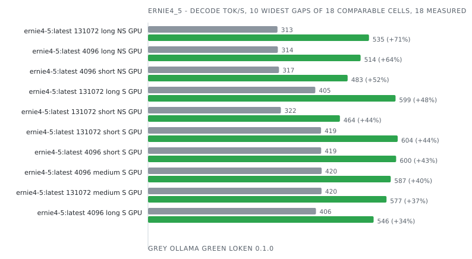

| Model | Ctx | Prompt | Mode | Device | Engine | Prefill tok/s | Decode tok/s | Tokens | E2E ms | J/req | J/token | Δ decode | Δ energy | Date |
|-------|-----|--------|------|--------|--------|---------------|--------------|--------|--------|-------|---------|----------|----------|------|

### gemma4

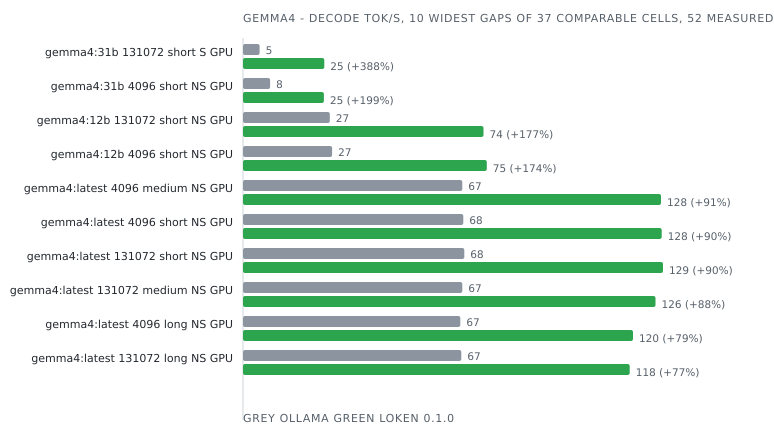

| Model | Ctx | Prompt | Mode | Device | Engine | Prefill tok/s | Decode tok/s | Tokens | E2E ms | J/req | J/token | Δ decode | Δ energy | Date |
|-------|-----|--------|------|--------|--------|---------------|--------------|--------|--------|-------|---------|----------|----------|------|

### gptoss

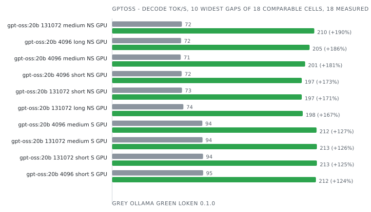

| Model | Ctx | Prompt | Mode | Device | Engine | Prefill tok/s | Decode tok/s | Tokens | E2E ms | J/req | J/token | Δ decode | Δ energy | Date |
|-------|-----|--------|------|--------|--------|---------------|--------------|--------|--------|-------|---------|----------|----------|------|

### granite

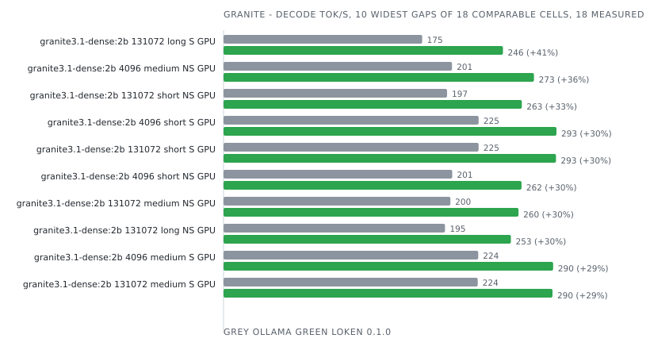

| Model | Ctx | Prompt | Mode | Device | Engine | Prefill tok/s | Decode tok/s | Tokens | E2E ms | J/req | J/token | Δ decode | Δ energy | Date |
|-------|-----|--------|------|--------|--------|---------------|--------------|--------|--------|-------|---------|----------|----------|------|

### granitemoe

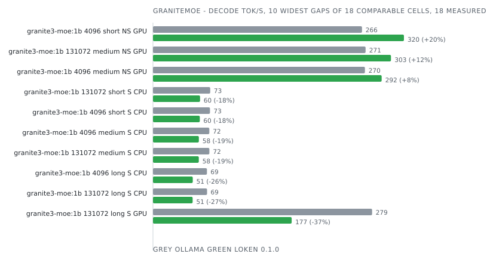

| Model | Ctx | Prompt | Mode | Device | Engine | Prefill tok/s | Decode tok/s | Tokens | E2E ms | J/req | J/token | Δ decode | Δ energy | Date |
|-------|-----|--------|------|--------|--------|---------------|--------------|--------|--------|-------|---------|----------|----------|------|

### lfm2

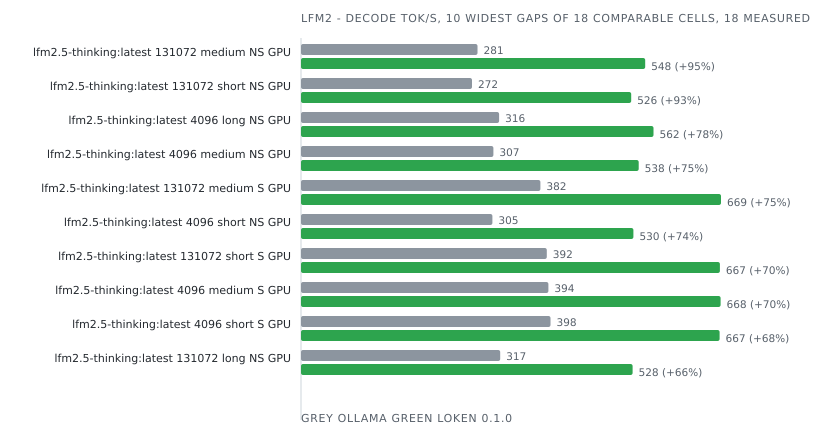

| Model | Ctx | Prompt | Mode | Device | Engine | Prefill tok/s | Decode tok/s | Tokens | E2E ms | J/req | J/token | Δ decode | Δ energy | Date |
|-------|-----|--------|------|--------|--------|---------------|--------------|--------|--------|-------|---------|----------|----------|------|

### lfm2moe

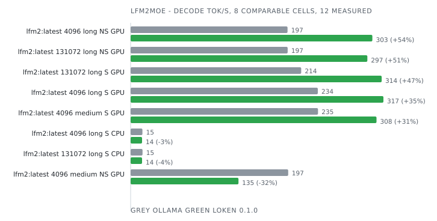

| Model | Ctx | Prompt | Mode | Device | Engine | Prefill tok/s | Decode tok/s | Tokens | E2E ms | J/req | J/token | Δ decode | Δ energy | Date |
|-------|-----|--------|------|--------|--------|---------------|--------------|--------|--------|-------|---------|----------|----------|------|

### llama

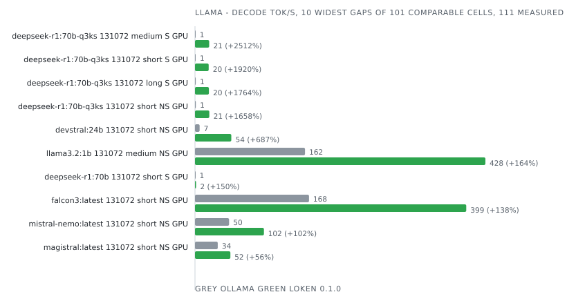

| Model | Ctx | Prompt | Mode | Device | Engine | Prefill tok/s | Decode tok/s | Tokens | E2E ms | J/req | J/token | Δ decode | Δ energy | Date |
|-------|-----|--------|------|--------|--------|---------------|--------------|--------|--------|-------|---------|----------|----------|------|

### mistral3

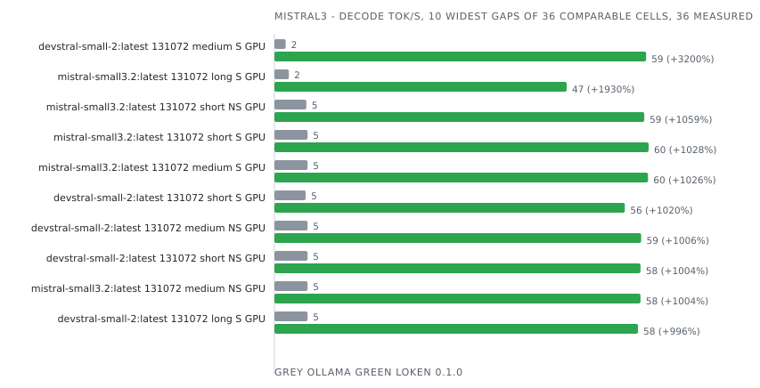

| Model | Ctx | Prompt | Mode | Device | Engine | Prefill tok/s | Decode tok/s | Tokens | E2E ms | J/req | J/token | Δ decode | Δ energy | Date |
|-------|-----|--------|------|--------|--------|---------------|--------------|--------|--------|-------|---------|----------|----------|------|

### nemotron_h_moe

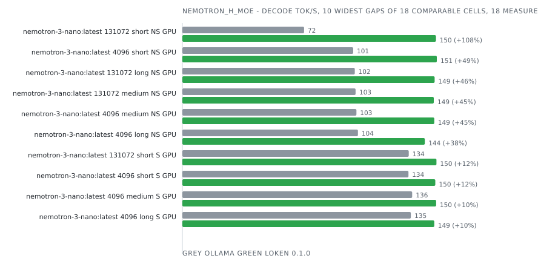

| Model | Ctx | Prompt | Mode | Device | Engine | Prefill tok/s | Decode tok/s | Tokens | E2E ms | J/req | J/token | Δ decode | Δ energy | Date |
|-------|-----|--------|------|--------|--------|---------------|--------------|--------|--------|-------|---------|----------|----------|------|

### olmo2

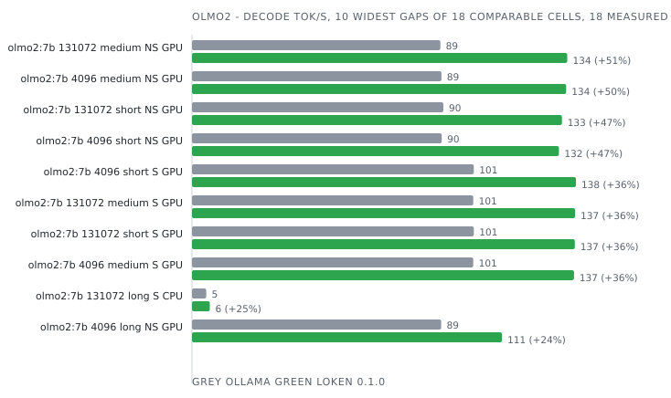

| Model | Ctx | Prompt | Mode | Device | Engine | Prefill tok/s | Decode tok/s | Tokens | E2E ms | J/req | J/token | Δ decode | Δ energy | Date |
|-------|-----|--------|------|--------|--------|---------------|--------------|--------|--------|-------|---------|----------|----------|------|

### olmoe

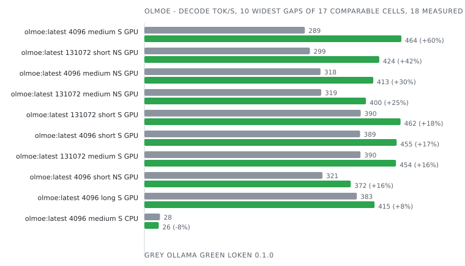

| Model | Ctx | Prompt | Mode | Device | Engine | Prefill tok/s | Decode tok/s | Tokens | E2E ms | J/req | J/token | Δ decode | Δ energy | Date |
|-------|-----|--------|------|--------|--------|---------------|--------------|--------|--------|-------|---------|----------|----------|------|

### phi2

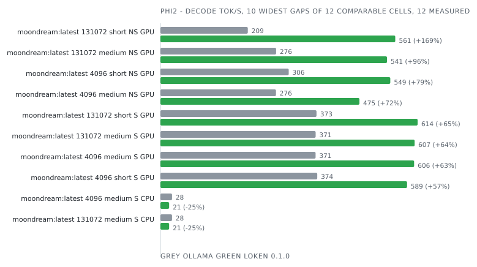

| Model | Ctx | Prompt | Mode | Device | Engine | Prefill tok/s | Decode tok/s | Tokens | E2E ms | J/req | J/token | Δ decode | Δ energy | Date |
|-------|-----|--------|------|--------|--------|---------------|--------------|--------|--------|-------|---------|----------|----------|------|

### qwen2

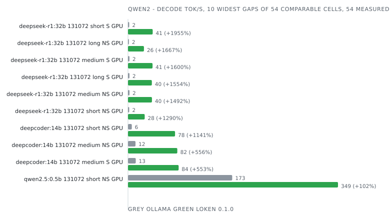

| Model         | Ctx  | Prompt | Mode   | Device | Engine          | Prefill tok/s | Decode tok/s | Tokens  | E2E ms    | J/req   | J/token   | Δ decode | Δ energy | Date             |
|---------------|------|--------|--------|--------|-----------------|---------------|--------------|---------|-----------|---------|-----------|----------|----------|------------------|
| deepcoder:14b | 4096 | short  | stream | GPU    | Ollama 0.32.6   | 71.7          | 52.6         | 128     | 4 688     | 646     | 5.046     |          |          | 2026-09-02 05:27 |
| deepcoder:14b | 4096 | short  | stream | GPU    | vLLM 0.22.0     | 847.8         | 85.0         | 128     | 1 555     | 330     | 2.575     |          |          | 2026-09-02 05:27 |
| deepcoder:14b | 4096 | short  | stream | GPU    | **loken 0.1.0** | **226.1**     | **82.4**     | **128** | **1 624** | **414** | **3.237** | -3.1%    | -20.4%   | 2026-09-02 05:27 |

### qwen3

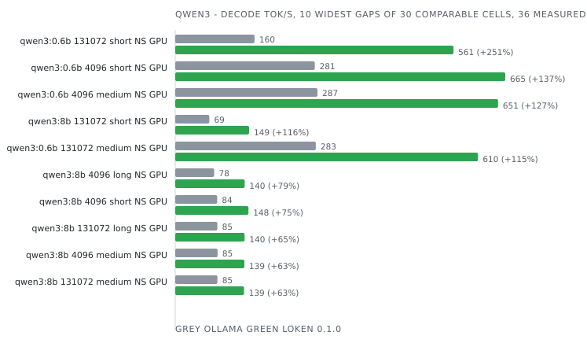

| Model | Ctx | Prompt | Mode | Device | Engine | Prefill tok/s | Decode tok/s | Tokens | E2E ms | J/req | J/token | Δ decode | Δ energy | Date |
|-------|-----|--------|------|--------|--------|---------------|--------------|--------|--------|-------|---------|----------|----------|------|

### qwen35

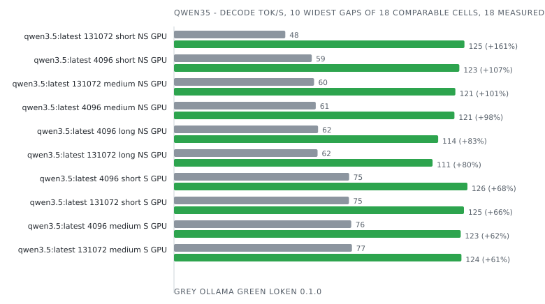

| Model | Ctx | Prompt | Mode | Device | Engine | Prefill tok/s | Decode tok/s | Tokens | E2E ms | J/req | J/token | Δ decode | Δ energy | Date |
|-------|-----|--------|------|--------|--------|---------------|--------------|--------|--------|-------|---------|----------|----------|------|

### qwen35moe

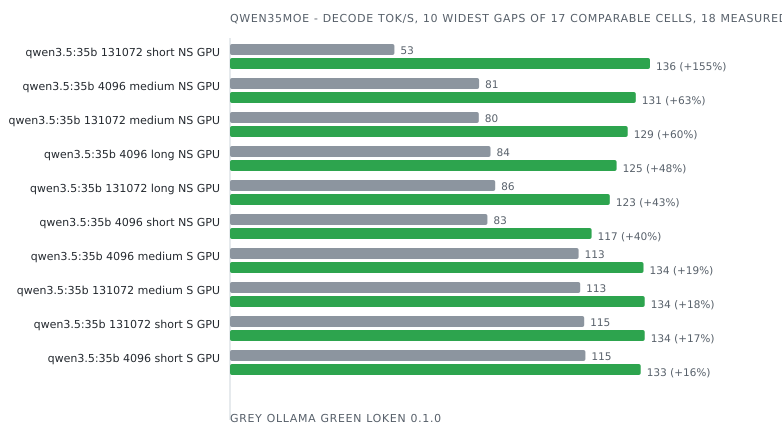

| Model | Ctx | Prompt | Mode | Device | Engine | Prefill tok/s | Decode tok/s | Tokens | E2E ms | J/req | J/token | Δ decode | Δ energy | Date |
|-------|-----|--------|------|--------|--------|---------------|--------------|--------|--------|-------|---------|----------|----------|------|

### qwen3moe

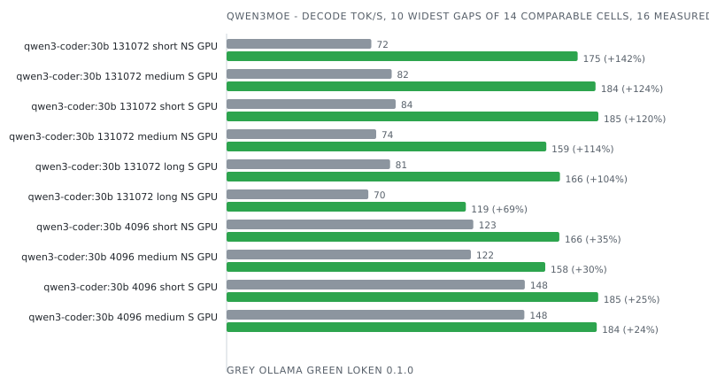

| Model | Ctx | Prompt | Mode | Device | Engine | Prefill tok/s | Decode tok/s | Tokens | E2E ms | J/req | J/token | Δ decode | Δ energy | Date |
|-------|-----|--------|------|--------|--------|---------------|--------------|--------|--------|-------|---------|----------|----------|------|

### qwen3next

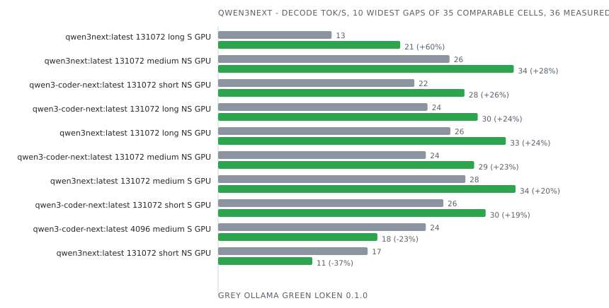

| Model | Ctx | Prompt | Mode | Device | Engine | Prefill tok/s | Decode tok/s | Tokens | E2E ms | J/req | J/token | Δ decode | Δ energy | Date |
|-------|-----|--------|------|--------|--------|---------------|--------------|--------|--------|-------|---------|----------|----------|------|

### smollm3

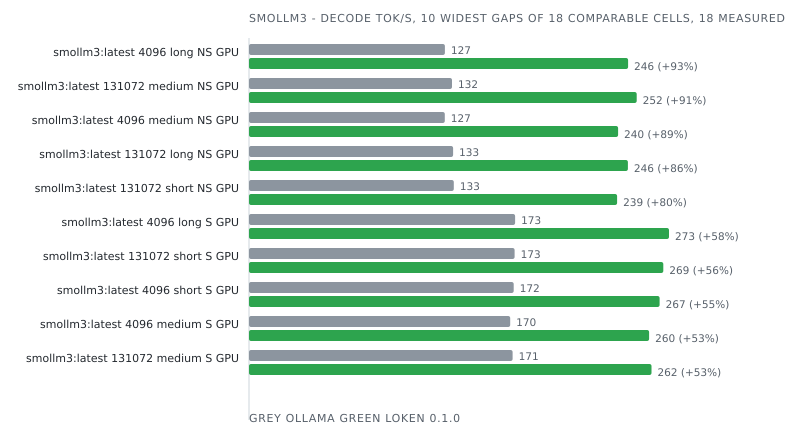

| Model | Ctx | Prompt | Mode | Device | Engine | Prefill tok/s | Decode tok/s | Tokens | E2E ms | J/req | J/token | Δ decode | Δ energy | Date |
|-------|-----|--------|------|--------|--------|---------------|--------------|--------|--------|-------|---------|----------|----------|------|
