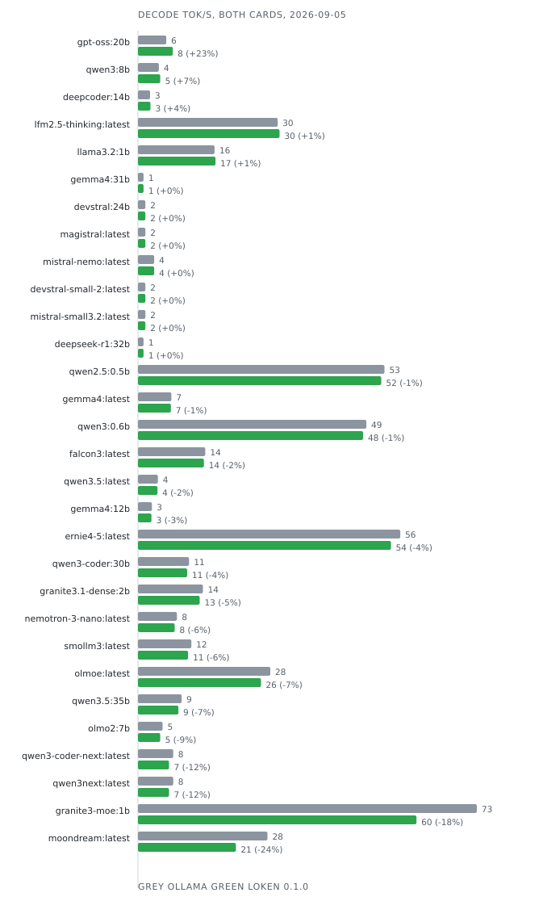

# Status

What is measured, what is slower, what has never run. Revised 2026-09-03.

Every figure comes from one machine: RTX 5070 Ti + RTX 5060 Ti (16 GB each), Linux, CUDA 13.3,
models on a USB disk reading at 460 MB/s.

## Decode rate vs ollama

Measured by the campaign of 2026-09-03 on the binary this page describes, and regenerated
from `docs/BENCHMARKS.md` by `scripts/figures.py` as the campaign advances. Conditions: both
cards available to every engine, idle machine, greedy, streamed, short prompt, 4096 ctx,
median of three iterations, decode tokens/s. The earlier table on this page came from a
one-card probe of 2026-08-27 taken between kernel changes; it is superseded, not corrected.

<!-- table:decode -->
| model | ollama | loken | |
|---|---:|---:|---|
| deepseek-r1:70b-q3ks | 6.9 | **21.3** | +209% |
| gpt-oss:20b | 94.6 | **211.8** | +124% |
| llama3.2:1b | 232.7 | **466.6** | +101% |
| falcon3:latest | 211.5 | **403.9** | +91% |
| devstral-small-2:latest | 35.5 | **59.9** | +69% |
| lfm2.5-thinking:latest | 397.6 | **666.9** | +68% |
| qwen3.5:latest | 75.4 | **126.3** | +68% |
| mistral-small3.2:latest | 36.3 | **59.8** | +65% |
| deepseek-r1:32b | 25.9 | **41.2** | +59% |
| moondream:latest | 374.5 | **589.0** | +57% |
| mistral-nemo:latest | 68.2 | **107.2** | +57% |
| qwen3:8b | 97.5 | **153.1** | +57% |
| smollm3:latest | 172.0 | **266.8** | +55% |
| deepcoder:14b | 53.0 | **81.7** | +54% |
| qwen3:0.6b | 485.9 | **720.9** | +48% |
| gemma4:latest | 91.4 | **133.1** | +46% |
| magistral:latest | 36.3 | **52.5** | +45% |
| ernie4-5:latest | 419.0 | **600.4** | +43% |
| devstral:24b | 36.3 | **52.0** | +43% |
| olmo2:7b | 101.0 | **137.6** | +36% |
| gemma4:12b | 54.6 | **73.9** | +35% |
| granite3.1-dense:2b | 224.6 | **293.1** | +30% |
| qwen2.5:0.5b | 306.5 | **382.2** | +25% |
| qwen3-coder:30b | 148.3 | **184.8** | +25% |
| olmoe:latest | 389.1 | **455.1** | +17% |
| qwen3.5:35b | 115.0 | **132.9** | +16% |
| nemotron-3-nano:latest | 133.9 | **149.8** | +12% |
| qwen3-coder-next:latest | 27.9 | **30.2** | +8% |
| qwen3next:latest | 32.8 | **33.8** | +3% |
| gemma4:31b | **25.7** | 24.9 | **-3%** |
| granite3-moe:1b | **339.1** | 323.0 | **-5%** |
| deepseek-r1:70b | **1.6** | 1.5 | **-6%** |
<!-- /table:decode -->

The two mixtures that lose here do not lose. Both rows came from a harness that had moved
into its own repository and started the engine without its configuration; measured configured
on 2026-09-02, olmoe is +17.4% and granite3-moe +0.2%. The clue was real, though, and pointed
elsewhere: the mixtures that do lose are the ones too large for the cards. A layer was placed
whole, so a spilled mixture ran attention on the host for the sake of expert weights that are
97% of its bytes and read a few at a time. Spilling the experts and keeping everything else on
the cards took qwen3next from 15.6 to 34.7 tok/s against ollama's 33, and qwen3-coder-next from
10.7 to 30.8 against 26-28. A mixture that already fits is untouched by it.

The table and the figure are regenerated together from `docs/BENCHMARKS.md` by
`scripts/figures.py`. They were transcribed by hand once, and the page ended up quoting a
parity for granite3-moe that appears nowhere in the measurements.

## Placement, measured separately

Given both cards, ollama splits models that fit on one; this engine keeps them on the fast
card, and pays nothing for having the second one present. Measured 2026-09-03, olmoe: 464 tok/s
on card 0 alone, 462 with both cards visible, 252 on card 1 alone - the placer picks the fast
card, and the 390-against-496 penalty an earlier revision of this page reported is gone.

For a model that fits on neither card the question is different, and the answer is the bus.
deepseek-r1:70b at Q4_K_M holds 26 of its 80 layers on the host, every one of them read in
full per token at ~36 GB/s, which is what this machine's DRAM gives: 1.51 tok/s here, 1.55
under ollama, both engines pinned to the same ceiling. There is no faster host path. There are
two ways out. A variant that fits - the FFN-at-Q3 requantisation the store already names but
never received weights. And a drafter: on that same cell, llama3.2:1b proposing and the 70B
verifying, `[inference] draft_model` gives 2.21 tok/s at 41.0 J/token against 1.49 and 51.8
alone, same answer token for token, with only 18% of drafts accepted - a better-matched
drafter would do better. That is a different configuration from "loken", and a table that
quotes it has to say so in the row.

The first table is the kernels. This one is the placement. Only the first says anything about
arithmetic.

## Costs

- **~870 MiB per load, any model.** CUDA contexts, cuBLAS workspace, preloaded module images.
  Fixed, not proportional - 893 and 867 MiB on models differing 2x in weights. The placement
  planner does not know about it.
- **First answer after load is slower.** A mixture pays ~0.5 s if a request arrives before the
  background repack finishes - when it fits. A spilled one pays far more: qwen3next decodes its
  first request at 2.0 tok/s and the next at 34.7. The benchmark table takes the median over
  its iterations, so that cost no longer reaches a published rate; a user's first answer still
  pays it.
- **A spilled model was double-held in host RAM.** The file was prefetched whole before
  placement, so the 28 GB already on the cards stayed cached beside the 14 GB the host actually
  reads, and a 64 GB box swapped 16 GB during the decode being timed. The advice now follows
  the plan - DontNeed for what the cards hold, WillNeed for what the host reads - and each
  layer's pages are dropped the moment it lands on a card, because waiting for the end of the
  load was already too late: the cache had reached 44 GB and 12-15 GB of the process had gone
  to zram, and the same cell then decoded anywhere between 1.5 and 2.2 tok/s from one run to
  the next. Dropped per layer, the cell measures 2.25 three times. What remains: the load
  still peaks at 49 GB of cache and pushes ~10 GB to zram in one burst, pages touched before
  the layer build; the token embedding dequantised to F32 on the host (4 GB for a 0.6 GB Q4_K
  table); and the file pages of host layers once their repack exists.
- **Load time is your disk.** 24 GB over USB: 52 s reading, 6 s to the cards.

## The cluster

Two halves live in [`CLUSTER.md`](CLUSTER.md), and only one of them runs.

**Replicated serving runs.** Any node is an entry point and an entry point holds nothing: a
client talks to whichever node it knows, that node forwards the whole HTTP request to the best
holder and relays the stream back. Membership is SWIM gossip with a phi-accrual detector,
seeded by multicast announcement or by a `join` list. `/api/cluster/state`, `/api/cluster/peers`
and `/api/cluster/prefix` report it. No consensus protocol: routing to a dead node costs a
retry, not a corruption.

A hand-over is priced on rates each node measures from its own completed generations, never
from hardware nameplates - what a card could do is not what this build achieves on this model
at this quantisation.

**Sharding does not.** Pipeline parallelism across hosts, the binary data plane it needs, the
link-cost matrix, the tiered KV, the resume path and the layer scheduler are all written and
reached by nothing. That is not a claim from reading: `distributed::wiring_gate` records the
state of every module in that directory and fails both when one of them is finally reached and
when one that was reached falls silent. Cross-host layer execution refuses loudly rather than
returning a placeholder.

**One defect found, and its fix unverified at two nodes.** A node published a capacity derived
from one generation's decode rate multiplied by its lane count, while its generations serialise
behind the model lock. Two comparable machines therefore priced each other an order of
magnitude apart, and the cluster handed over a few requests where it should have split the work
roughly in half. The meter now publishes what a window of real completions produced. The second
machine left the bench before the fix could be measured, so **the two-node gain is currently
unmeasured** - the correction is judged by trace replay, not by a cluster.

**Open.** A peer that has never answered is priced from a floor rather than from its catalogue,
so a cold node looks worse than an idle one that holds nothing. And a replica set keyed on a
placeholder digest - what models cached from Hugging Face carry - groups every such model into
one set.

## Written, wired to nothing

- **Layer scheduler** (`src/distributed/layer_scheduler.rs`) - one caller: itself, since the
  engine that used to build a plan by hand was removed. Judged over 21 placement and 119 naming
  cases, with two perturbations proving the judge can fail.
- **Reserve pass** (`src/tensor/dry.rs`) - runs the forward on a device that allocates nothing,
  to replace the per-model formulas. Called from one site, in Z-Image. Every language-model
  placement is still budgeted by formula.

## Shipped as source, never compiled

The CUDA kernels carry AMD arms - MFMA on CDNA, WMMA on RDNA3+ - guarded and complete. There is
no hipcc build here, so none has been through a compiler. Treat AMD as source, not support.

## Next

A Vulkan backend. One generic compute backend reaches AMD, Intel and NVIDIA; HIP reaches one
vendor and a subset of its cards.

## Judged partially

- **Mat-vec core** - checked against an independent reference for 2 formats of 10. The production
  entry point does not reach the core.
- **Z-Image bends its schedule twice.** `new` derives timesteps from bent sigmas,
  `set_timesteps` from the pre-bend ramp. At 9 steps: `[1.0, 0.960129, 0.913349, ...]` against
  `[1.0, 0.96, 0.913043, ...]` for one bend. Only a render says which the checkpoint expects.
- **Image parity is a hash**, one prompt and seed per family - and not a property of the code
  alone. The placer reads free VRAM at load, and four runs of one binary gave four hashes. Run it
  on a quiet machine.

## Measured and refused

A 3-bit KV cache through a randomised Hadamard rotation. The rotation is orthogonal and does
spread outliers (excess kurtosis 35.7 -> -0.6); against f16 it delivers what it promises. Against
the Q4_0 cache already here it does not: token-axis grouping removes the outliers first, so
rotating changes the error by under 0.5%, and Q4_0 is 2.6x more accurate for one more bit. The
harness stays, wired to nothing.

## Borrowed code

One file shares body lines with upstream, at 58%, recorded in [`NOTICE.md`](../NOTICE.md). Its
largest matched range is the GGUF k-quant bit specification, which any correct reader reproduces.

## Open

The 870 MiB nobody budgets, and the reserve pass reaching language models. Each has a
measurement waiting. olmoe's deficit is closed: it was the harness, not the engine.

Two speculative loops. The plain stream carries one, gated per step by a calibrator; the
attach endpoint and a configured drafter drive another, `generate_stream_with_draft`. On the
same target and drafter the first gave 1.68 tok/s and the second 2.21. One of them should go,
and the measurement says which.
