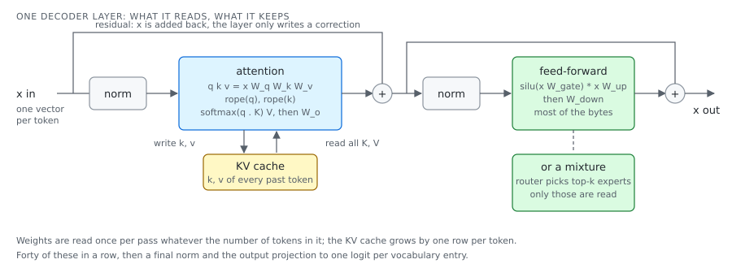

# One layer, then forty of them

A transformer is one block repeated. The whole model is that block applied twenty-eight or
ninety-two times, and the next lessons (what is read per token, what is kept between tokens)
fall out of it.

## The idea

An id becomes a vector by a table lookup, the **embedding**, of width `d` (1024 on
qwen3:0.6b). From then on every token is one such vector, and a layer is a function from a
vector to a corrected vector. The correction is added to the input, the **residual**, so a
layer only has to learn what to change.



Two sub-layers, each behind a **norm** (RMSNorm divides by the root-mean-square of the
vector and scales by a learned weight):

- **Attention** lets a token read the others. Three projections give a query, a key and a
  value per token. The query is scored against every earlier key, the scores go through a
  softmax, and the token's output is the values weighted by those scores, then one more
  projection. Before the scoring, **RoPE** rotates query and key by an angle that grows with
  the position, which is how the model knows distance. Heads run this in parallel on slices
  of the vector; in **grouped-query attention** several query heads share one key and value
  head (16 against 8 on qwen3), which halves what has to be kept per token. **Latent
  attention** (DeepSeek) goes further and keeps one compressed vector per token, decompressed
  when read.
- **Feed-forward** is two matrices with a gate in between: `silu(x W_gate) * (x W_up)`,
  then `W_down`. It is where most of a dense model's bytes are. A **mixture of experts**
  replaces it with many such blocks and a router: a small projection scores the experts, the
  top `k` are run (8 of 128, say) and their outputs summed with the router's weights. Only
  those experts' bytes are read for that token.

After the last layer, a final norm and the output projection give one **logit** per
vocabulary entry; lesson 7 turns that row into a token.

What a layer reads: its weights, once per pass, whatever the number of tokens in the pass.
What it keeps: the key and value of every token it has seen, lesson 6.

## In loken

| File | What it decides |
|---|---|
| `src/inference/generic_transformer/mod.rs` | One layer struct for every `blk.{i}.*` decoder: the optional pieces (split or fused QKV, q/k norms, post-attention norms, a mixture) are detected from the checkpoint's tensors, so Qwen2/3, Gemma, Phi and the others share the code. |
| `src/inference/generic_transformer/layer_attn.rs`, `layer_ffn.rs` | The two sub-layers, with the sliding-window variant and the fused paths. |
| `src/inference/model/rope.rs` | The rotary table, and YaRN: high-frequency dimensions kept, low-frequency ones interpolated, so a model trained at one length answers past it. |
| `src/tensor/ops/attention.rs` | The attention op itself: scaled dot product, the grouped-query repeat, the two rotary pairings, the fused prefill. |
| `src/inference/fused_moe.rs` | The router and the batched expert projections it feeds. |
| `src/inference/model/deepseek_v41/attention.rs` | Latent attention with a single shared key head, an fp8 round trip and a learned attention sink. The `model/` directory holds one such directory per family. |
| `src/inference/engine/model_backend.rs` | The trait each architecture implements, which replaced a match over every variant. |

The papers behind each family are listed in [`../REFERENCES.md`](../REFERENCES.md).

## What was measured

**Judging a port without running the original (2026-09-12 to 14).** The DeepSeek V4.1 port
was gated against the authors' own `model.py`, unmodified, run on the CPU: their kernel
module was shadowed on the import path by a pure-torch one, which works because their
linear layer dispatches on the weight's dtype and bf16 never reaches a compiled kernel.
Each phase of the reference dumps its inputs and outputs into `tests/vectors/`, and a test
here replays the phase on the same inputs. The gates: attention within 1.3e-2 relative L2,
the mixture within 3.8e-3, the hyper-connections under 5e-3, the fp8 and fp4 dequantisers
bit-exact.

Two pitfalls, both finite and wrong, neither visible as an error: casting the reference's
rotary table to fp32 drops the imaginary half, so RoPE applies half its rotation; and a
lazily evaluated closure bound its loop variable late, so every expert came from the last
layer (one layer matched, two gave cosine 0.92, an hour to find).

**Gating a mixture is not gating a matrix (2026-09-13).** The router's top-k is a discrete
choice, so any precision gap between an f32 port and a bf16 reference flips the occasional
borderline token to another expert. One flipped token out of 64 moved the block's relative
L2 from 1e-2 to 6e-2 while every other token agreed and the cosine stayed at 0.998
(attention sub-layer 1.5e-2, stream after the hyper-connection 9.8e-3, block output 5.8e-2:
the jump is one token). A tight global threshold fails correct code; a loose one hides real
bugs. The gate that separates the two: cosine over the whole tensor, a bounded count of
tokens over a per-token threshold, and the pre-routing stages gated tightly on their own.

## Try it

The vectors are in the tree:

```sh
ls tests/vectors/
cargo test --lib deepseek_v41::attention
```

Expected: `ratio0_attention_matches_the_reference` and `ratio0_rope_table_matches_the_reference`
pass. Open the test, find the tolerance the first one asserts against `rel_l2`, divide it by
ten and run again: the assertion names the stage and the measured error, which is what a
parity test is for. `cargo test --lib deepseek_v41::moe` runs the mixture against its vector
and the streamed experts against the resident ones.
