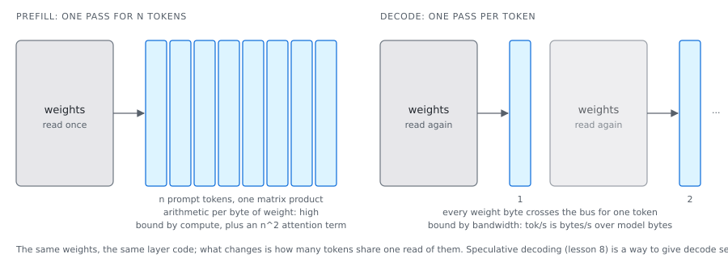

# Two regimes, one model

A request runs the same layers in two regimes: once over the whole prompt, then once per
generated token. Prefill is bound by arithmetic, decode by bytes. Most of what an inference
server does is arranging for each to hit its bound.

## The idea



**Prefill** takes the n prompt tokens through every layer in one pass. Each projection is a
matrix times a matrix of n rows: every weight byte read serves n tokens, so the arithmetic
per byte is high and the pass is bound by how fast the card multiplies. Attention adds a
term that grows with n squared, since every token scores against every earlier one; at long
prompts that term is where the time goes.

**Decode** generates one token per pass. Each projection is a matrix times one row: every
weight byte read serves one token, so the pass is bound by how fast the bytes arrive, and
the token rate is close to memory bandwidth over model bytes. A model that fits on a card
reads at the card's rate; a layer left on the host reads at the host's, an order of
magnitude slower; a layer streamed from disk reads at the disk's, another order below.

Two consequences shape a server. Prefill is cut into **chunks** so its activations fit
beside the weights (a chunk's peak scales with chunk length times the widest feed-forward),
which also lets a long prompt yield to other requests. And since a decode step reads the
weights anyway, several sequences can share the read: a **scheduler** decides at every step
which requests prefill and which decode, admits new ones when cache blocks free, and
preempts under pressure, so the card is never idle while a slow request finishes.

Orders of magnitude on this machine: qwen3:0.6b prefills 1 782 tokens in 50 ms and decodes
at about 730 tokens a second on an RTX 5070 Ti; its 522 MB read at that rate is well under
the card's bandwidth, the rest being fixed per-step costs (launches, the sampling round
trip), which is what capturing a decode step as one CUDA graph reduces. A 70B at Q4 with 26
of 80 layers on the host decodes at 1.5 tokens a second, pinned to the host's 36 GB/s
([`../STATUS.md`](../STATUS.md#placement-measured-separately)).

## In loken

| File | What it decides |
|---|---|
| `src/inference/engine/model_backend.rs` | The prefill chunk, derived from the free VRAM and the widest feed-forward rather than a constant, and the chunked prefill with its out-of-memory ladder. |
| `src/inference/serve/scheduler.rs` | The iteration-level scheduler: a plan per step (who prefills, who decodes, with their block tables), a prefill token budget, preemption that never half-allocates. Pure bookkeeping, tested without a card. |
| `src/inference/serve/continuous_serve.rs` | The worker thread that owns the model and the paged cache and is the only caller of the forward. |
| `src/inference/serve/batched_forward.rs` | The batched forward as an f32 specification, and the batch-invariance contract a real backend has to meet. |
| `src/inference/kernel/cpu_decode_exec.rs` | The host decode path with a preallocated arena, so a token on the host allocates nothing. |
| `src/inference/place/layer_perf.rs`, `src/api/handlers/system.rs` | The per-layer and per-stage timers behind `/api/layer_perf` and `/api/stage_perf`; off by default because each stage costs a device synchronisation. |

## What was measured

**Where a long prefill's time goes (2026-09-11, RTX 5070 Ti and 5060 Ti, qwen3-coder
30b-a3b, chunk 512, Q4 KV).** Prefill time was fitted on three prompts of real source, non-
streamed and cache-busted, to a two-term model accurate to about one percent:

| build | prefill(n) in ms |
|---|---|
| before | `1.369 n + 1.655e-4 n^2` |
| after | `1.372 n + 2.048e-5 n^2` |

The linear term did not move; the quadratic one is eight times cheaper, and a full
131 072-token cold prefill went from 50.4 to 8.9 minutes. What changed: attention runs band
by band with a running maximum instead of holding every score at once, six passes became
one fused kernel, and the whole-context causal mask, built on the host and copied to the
card every pass, is gone. At 10 151 tokens the stages read experts 76% (gate and up 37.5%,
down 36.7%), attention 21%, router 1.6%; at 44 363 tokens attention is 43%, being the
quadratic half.

**Three leads measured and rejected, same day:** a hand-written scalar flash-attention
kernel (83.6 s against 26.8 s for cuBLAS, which has the tensor cores); the prefill sent
through the tensor-core expert path instead of the fused decode-shaped kernel (7 119 ms
against 6 271 ms); a chunk of 2 048 instead of 512 (19.8 s against 16.2 s, since the score
band shrinks with the chunk).

**A misreported measurement.** Until the same day, the streamed request's log line reported
a word-count estimate of the prompt, not the tokenizer's count. On source code that is
nearly half, so every streamed measurement read as twice as slow per token as it was. The
usage chunk was always right; the fit above used it.

## Try it

Switch the stage timers on, run one prompt of a few hundred tokens, read the table, switch
them off:

```sh
curl -s 'localhost:11435/api/stage_perf?enable=1' > /dev/null
curl -s localhost:11435/api/generate -d @prompt.json > /dev/null
curl -s localhost:11435/api/stage_perf | python3 -c "
import sys, json
d = json.load(sys.stdin); print(d['layer_calls'], 'layer calls', d['total_us'], 'us')
for s in d['stages']:
    if s['total_us']: print(f\"{s['stage']:10} {s['share']:.2f}\")"
curl -s 'localhost:11435/api/stage_perf?enable=0' > /dev/null
```

Observed with a 715-token prompt on qwen3:0.6b: 28 layer calls; attention 0.83, the
feed-forward (reported under `experts`, the stage a mixture would route) 0.13, norms and
residual adds the rest. The `prompt_eval_duration` of the reply is a little higher while
the timers are on; that is the synchronisation, and why they are off by default. A mixture
fills the `router`, `gate_up` and `down` rows instead.
