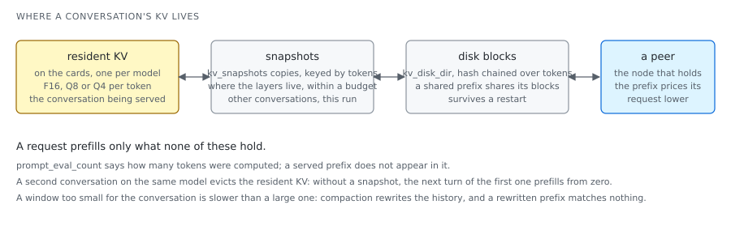

# What the model remembers between tokens

Attention lets a token read every earlier one, which would mean recomputing every earlier
key and value at each step. The cache keeps them instead.

## The idea

For every token seen, every layer keeps its key and value vectors, one row each per key
head. On qwen3:0.6b that is 28 layers times 8 heads times 128 values times two, 57 344
numbers a token, 112 KB at F16; a 4 096-token window is 460 MB, close to the weights. On a
larger model the cache is where the memory goes, and the per-token bytes are what
grouped-query and latent attention were invented to cut.

The cache is also **state**: a conversation's next turn is the same prompt plus a little,
and a server that keeps the cache prefills only the little. This drives a series of
designs:

- **paging**: the cache is a pool of fixed blocks and a sequence holds a block table, so
  several sequences share one pool without reserving a full window each, and two prompts
  with a common prefix can share its blocks;
- **quantised caches**: keys and values at eight bits, or at four with the key scale taken
  per channel (a key's channels have systematic outliers, so a per-token scale loses them);
- **sliding windows**: some layers attend only to the last n positions and keep no more;
- **snapshots**: after a request the resident cache is copied aside under its tokens, so
  another conversation can take the cards and this one can come back;
- **a disk tier**: full token blocks written after a response, keyed by a hash chained
  over the tokens, so a shared prefix is written once and survives a restart;
- **reuse past the window**: when a conversation outgrows the window, keep the tail and
  re-phase its positions rather than prefill the window again.

Two rules follow:

- **One live cache** per model, so two conversations served in alternation evict each other
  unless a snapshot holds the other.
- **A window too small** is slower than a large one: compaction rewrites the history from
  near its start, and a rewritten prefix matches nothing that is held.

## In loken

| File | What it decides |
|---|---|
| `src/inference/cache/mod.rs` | Everything that remembers between tokens: the index of this directory. |
| `src/inference/cache/paged_kv.rs`, `paged_attention.rs` | The block allocator and block tables, pure bookkeeping tested without a card; and the attention that reads through them. |
| `src/inference/cache/q4_kv.rs`, `q8_kv.rs` | The quantised caches: why a per-token 4-bit key failed and the per-channel scheme that replaced it; the 8-bit layout that appends one row per step with one copy. |
| `src/inference/cache/kv_disk.rs` | The disk tier: blocks, the chained hash, one manifest per sequence, writes off the request path. |
| `src/inference/cache/turboquant/mod.rs` | A 3-bit cache written as a host reference so that the measurement deciding whether to write the kernel exists first. Read `measure` before the rest. |
| `src/inference/engine/llm_engine/load.rs` (`kv_reuse_start`) | What a new prompt reuses: the resident prefix, a snapshot that covers more of it, a disk sequence that covers more still, each rounded down to a prefill chunk. |
| `src/inference/engine/llm_engine/params.rs` | The keys: `kv_snapshots`, `kv_disk_dir`, the budgets, `kv_shift_reuse`; the guide is [`../guides/kv-memory.md`](../guides/kv-memory.md). |

## What was measured

**Snapshots (2026-09-06, desktop node).** Two conversations of two hundred lines each,
alternated, at a 8 192-token window: the prefill of an alternated turn went from about
5 195 tokens to about 1 100 on gemma4 (1 170 ms to 300 ms). Extended the same day to
quantised caches, captured by dequantising a layer to F16 and restored by re-quantising it
on the same grid: llama3.2 at Q8 4 553 to 457 tokens with bit-identical output, qwen3 at Q4
5 233 to 1 137 within one quantisation step. The disk tier persists only prefix-uniform
snapshots, with a sliding-window model's windowed layers in a side blob; gemma4 re-prefilled
1 248 of 3 296 tokens after a restart. Tried and removed: deflate on the blocks (395 MB in
15 s against 433 MB in 5 s) and a second on-disk format at eight bits; the disk holds the
native dtype, and disk and memory hold the same values bit for bit.

**Three bits, measured and refused.** A randomised Hadamard rotation does spread the
outliers (excess kurtosis 35.7 to -0.6) and beats F16 as promised. Against the 4-bit cache
already here it does not: per-channel grouping removes the outliers first, so rotating
changes the error by under 0.5%, and Q4_0 is 2.6 times more accurate for one more bit
([`../STATUS.md`](../STATUS.md#measured-and-refused)).

**One cache per model (2026-09-11).** An agent's speculative read ran at batch priority on
the same model as its conversation, so every interactive step re-prefilled from nothing:
137 s where a reuse costs 1.2 s. Work that yields now goes to a peer that can serve the
model or is declined, and the pricing cannot see this cost, since it falls on a different
request than the one being priced. On the same day, the same question at two windows:
301 s at 32 768 tokens against 24 s at 131 072, with later turns at 250 ms against 60 s,
which is why the agent's default window is the large one.

## Try it

The reused prefix is rounded down to a prefill chunk, and on a small model with a free card
the chunk is 2 048 tokens (`adaptive_prefill_chunk` in
`src/inference/engine/model_backend.rs`), so the conversation has to be longer than that to
show anything. With `kv_snapshots = 4` in the configuration, send a first turn of about
4 400 tokens on conversation A, then its second turn, then a first turn of another
conversation B, then A's second turn again, each with `"options":{"num_ctx":8192}`, and read
`prompt_eval_count` and `prompt_eval_duration` on each reply.

Observed on qwen3:0.6b, RTX 5070 Ti:

| turn | `prompt_eval_count` | `prompt_eval_duration` |
|---|---|---|
| A, first turn, cold | 4422 | 592 ms |
| A, second turn | 381 | 24 ms |
| B, first turn, cold | 4522 | 472 ms |
| A, second turn again | 381 | 26 ms |

The second turn computed 381 tokens: two chunks of the 4 477 shared were reused and the
remainder recomputed. The last line came from a snapshot, and the daemon's log says so:
`kv snapshot restored: 4477 tokens shared with the prompt, 4506 resident`. With
`kv_snapshots = 0` the last line prefills like the first. With turns shorter than a chunk
nothing is reused at all, and the counts say so.
