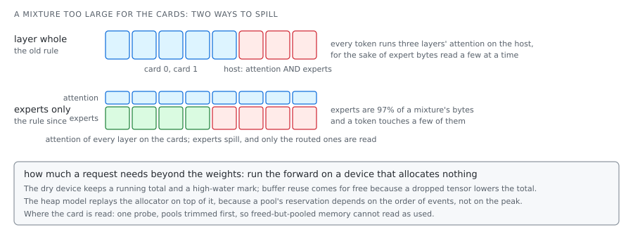

# Fitting a model on the machine you have

Where each part of a model sits decides its speed more than any kernel does. Fastest card
first, then the next, and the host takes only what no card can hold. Below the host is disk,
another order slower again.

Three things make it hard:

- **Weights are not the whole cost.** Add activations, a KV cache for every token of the
  window, kernel workspace, and about 870 MiB fixed per loaded model. None of it is in the file.
- **The allocator is not the program.** A card reports its pool's reservation, which depends on
  the order of allocations and frees, not on the peak the program held.
- **A mixture is not a dense model.** Its experts are ~97% of its bytes and a token touches a
  few of them, so spilling a whole layer, attention included, to keep experts together is the
  wrong cut.

Past the host, the metric becomes bytes read per token: which experts a token needs, how many
the last token needed too, what the page cache kept, whether reading overlaps computing. Across
machines the rule is the same: forward a request only when the peer's predicted completion plus
the trip beats serving it locally.



## In loken

| File | What it decides |
|---|---|
| `src/inference/place/plan.rs` | The heterogeneous plan every block stack uses: pack the fastest card first, spill card to card to host, never out of memory. |
| `src/inference/place/vram_manager.rs` | The one place placement reads a card's state from: pools trimmed before the probe, a reclaim registry for idle media residents, headroom for a hot component before it loads. |
| `src/tensor/dry.rs`, `src/tensor/heap.rs`, `src/inference/place/dry_plan.rs` | The circularity break: measure a request's peak by running the forward on a device that allocates nothing, then replay the allocator's chunk and hole behaviour on top of it. |
| `src/inference/place/placement_invariants.rs` | The fleet rule as tests: the cards decide, not the budgets; no placement decides on a name or an index; every hot component can span n cards. |
| `src/inference/place/layer_executor.rs` | The host budget as a share of the machine, not a constant. |
| `src/inference/offload/streamed.rs`, `room.rs`, `cuda.rs` | The streamed placement for a model larger than the cards and host together: the weights every token reads and as many routed experts as the room allows, kept on the cards fastest first, under the same switches as every other placement. |
| `src/inference/offload/store.rs` | The hot tier over streamed experts: views into the mapping, least-recently-routed eviction, cold experts dropped from the page cache once they have run. |
| `src/distributed/routing.rs` | Which node answers, by predicted completion rather than by load. [`../CLUSTER.md`](../CLUSTER.md) has the cost model. |

## What was measured

**Spill the experts, not the layer (2026-09-02/03).** A layer placed whole ran a spilled
mixture's attention on the host for the sake of expert weights that are 97% of its bytes and
read a few at a time. Spilling only the experts: qwen3next 15.6 to 34.7 tokens a second (ollama
33), qwen3-coder-next 10.7 to 30.8 (26 to 28). A mixture that already fits is untouched. Costs
the planner cannot see: ~870 MiB per loaded model whatever its size, and a spilled model held
twice in host memory until the page advice followed the plan.
([`../STATUS.md`](../STATUS.md#decode-rate-vs-ollama))

**A 552B mixture on a USB disk (2026-09-14/17).** DeepSeek V4.1 Flash, 340 GB on a disk that
reads 440 MB/s with one reader (461 to 464 with two to sixteen: parallel readers buy nothing,
only fewer bytes and overlap count). Routing has locality: 32% of a token's experts were the
previous token's, 50% within the last four, 67% within sixteen. A managed hot tier over the
page cache, in a controlled off/on/off/on alternation (6.29, 5.91, 6.06, 6.04 s a token),
bought ~5% of the bytes and 2% of the time, because the kernel's own eviction already does the
job at that horizon. Two things made it worse, do not retry: anonymous copies of hot experts
(41 GB copied, 22 into compressed swap, 10.7 s a token), and `MADV_RANDOM` on the expert
stacks, which cut reads from 342 to 46 MB/s. Prefilled as one batch on the cards, a 1024-token
prompt reads 141.6 GB of experts in 348 s at 407 MB/s against a 320 s disk floor: disk-bound,
and the levers left are the bytes.

**Two nodes, no hand-over (2026-09-13).** Fifty concurrent requests on qwen3:0.6b, a desktop
(RTX 5070 Ti) and a laptop (8 GB card): the desktop served locally 554 times and forwarded 0.
Not a defect, the router forwards only when the peer lowers the predicted completion, and the
fast card drains its queue faster than a hop to a slower one. The laptop's value is holding a
model the desktop does not. ([`../STATUS.md`](../STATUS.md#the-cluster))

## Try it

```sh
curl -s localhost:11435/api/models/loaded | python3 -m json.tool
```

With qwen3:0.6b: one entry, `num_layers: 28`, one `layer_distribution` element on `CUDA` 0
covering layers 0 to 27. Ask for a model larger than one card (qwen3-coder:30b at Q4_K_M is
18 GB on 16 GB cards) and read the route again: two elements, one per card. A model larger than
both cards adds a `CPU` element, and its decode rate falls to the host's bandwidth over the
bytes it holds.
